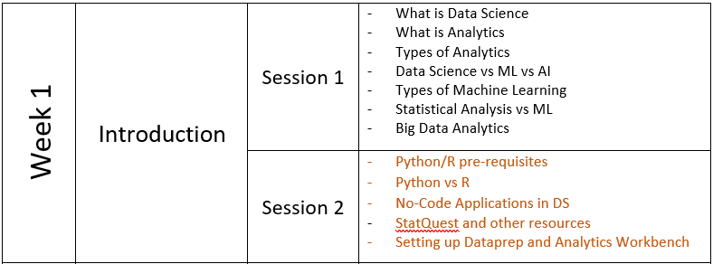
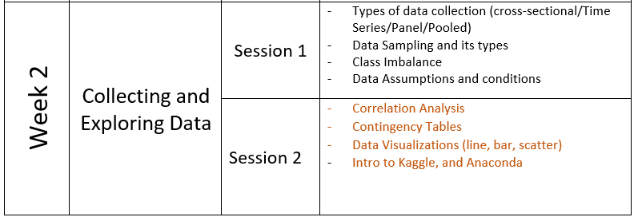
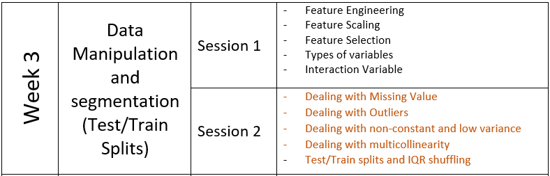
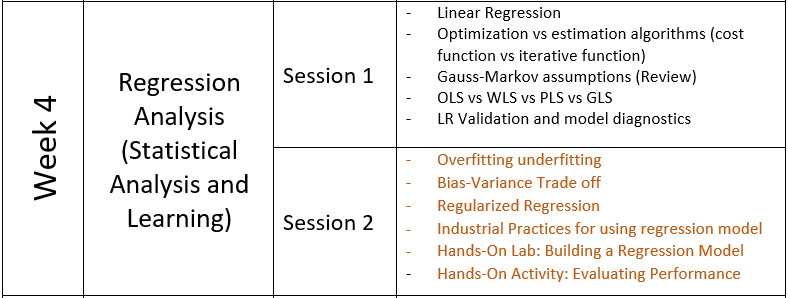
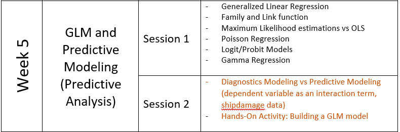
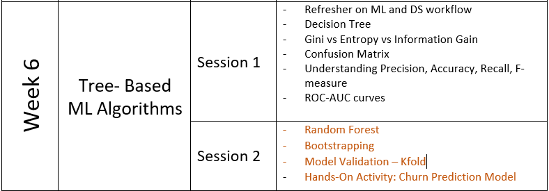
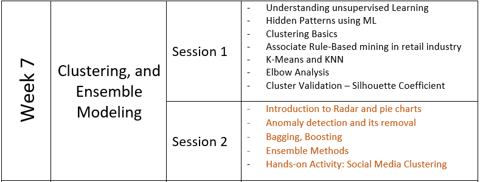
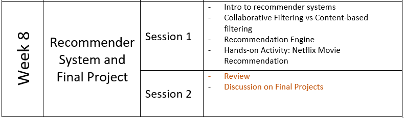

# Data Science For Starters - Video Series
This is a video series of 16 sessions that gives a head start to anyone new to the world of data science. 
I have added resource material, datasets, sample python scripts and PowerPoints for each topic. 

## About the Course

In this course you will explore how to get into Data Science with a non-mathematical background. You would be practicing with Python programming to work on Data Science models and visualizations. You will also be replicating those steps in Astera DataPrep and Analytics Workbench. 

This training will help you build fundamental concepts in all three elements of Data Science – Statistics, Machine Learning, and ML Pipelines. We’ll be covering the core process of Data Science from Data Manipulation, Descriptive Analytics and Visualization to Statistical Analysis, Machine Learning models, and Regression Algorithms. 

By the end of this training, you will have enough knowledge and hands-on expertise in different tools of Data Science to use and apply them in the real world around you. 

Instructor 1: Ayesha Amjad

Instructor 2: Shehmeer Adil

Support: Danish Hudani

## Timings and Duration

This is an 8 weeklong training with 75-minute sessions twice a week. 

## Course Outline

#### 

